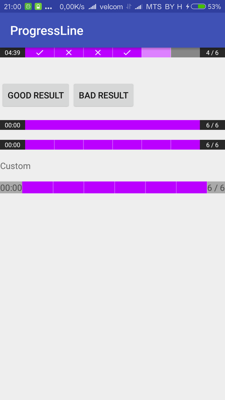

# ProgressLineLib

[](https://oss.sonatype.org/content/repositories/releases/team/fastflow/kusu/ui-progressline/)

<a href="https://play.google.com/store/apps/details?id=team.fastflow.example.ui.progressline">
  
</a>

| прогресс | прогресс | конец |
| --- | --- | --- |
|  |  |  |

## Начало

в **build.gradle**

```java
dependencies {
    compile 'team.fastflow.kusu:ui-progressline:1.1.0-BETA'
}
```

в **xml**

```java
<kusu.ui.progressline.Views.ProgressLine
		android:layout_width="match_parent"
		android:layout_height="wrap_content"/>
```

===

принудительно перейти на следующий шаг

```java
 public void nextStep(int result)
 public void nextStep()
 ```
 
 Переход на следующий шаг, запись результата текущего шага. Переменная может быть:
 1. State.GOOD
 2. State.BAD
 3. State.EMPTY

---

## Атрибуты у View

###№ Стиль

```java
pl:layout format="reference"
```

Переопределяет файл разметки. Должны быть:

* 1. **TextView** id == firstBlock. Для таймера
* 2. **TextView** id == secondBlock. Для этапов
* 3. **ui.views.Line** id == progress. Для рисования прогресса

===

#### Цвета
```java
pl:background_color format="color"
pl:progress_color format="color"
pl:current_color format="color"
pl:divider_color format="color"
pl:time_end_color format="color"
```

Атрибуты отвечают за:

* 1. цвет фона
* 2. цвет прогресса
* 3. цвет текущего этапа (для **STEP** и **TIME_STEP**)
* 4. цвет разделителя (для **STEP** и **TIME_STEP**)
* 5. цвет мигания времени, когда оно заканчивается (для **TIMER** и **TIME_STEP**)

===

#### Drawables
```java
pl:step_empty format="reference"
pl:step_good format="reference"
pl:step_bad format="reference"
```

Атрибуты отвечают за:

* 1. иконку неуказанного результата
* 2. иконку верного результата 
* 3. иконку неверного результата

===

#### Разное
```java
pl:type format="enum"
pl:time_max format="integer"
pl:step_max format="integer"
pl:time_red format="integer"
pl:duration format="integer"
pl:draw_time format="boolean"
pl:draw_arrow format="boolean"
pl:divide_height format="dimension"
pl:step_visible format="boolean"
pl:step_padding format="dimension"
```

Атрибуты отвечают за:

* 1. тип прогресса (описание ниже)
* 2. то, сколько времени дается на этап **(секунды)**
* 3. то, сколько будет этапов
* 4. то, с какого момента таймер будет мигать **(секунды)** (для **timer и time_step**)
* 5. время цикла одного мигания **(милисекунды)** (для **timer и time_step**)
* 6. то, рисовать ли время
* 7. то, рисовать ли треугольник в конце лини прогресса (для **timer**)
* 8. толщину линии разделителя на этапы (для **step и time_step**)
* 9. то, рисовать ли разделители
* 10. отступы для иконок

---

### Type

* 1. **step** - показывает этапы. Таймер показывает, сколько времени прошло с момента начала теста. ()
* 2. **timer** - показывает сколько времени прошло от текущего этапа. Таймер показывает, сколько времени осталось на этот этап.
* 3. **time_step** - показывает этапы. Таймер показывает, сколько времени осталось на этот этап.

---

### Copyright (c) 2016 FastFlow team

Полный текст лицензии содержится в файле License.md
